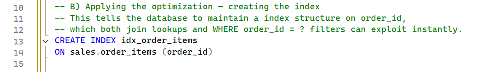
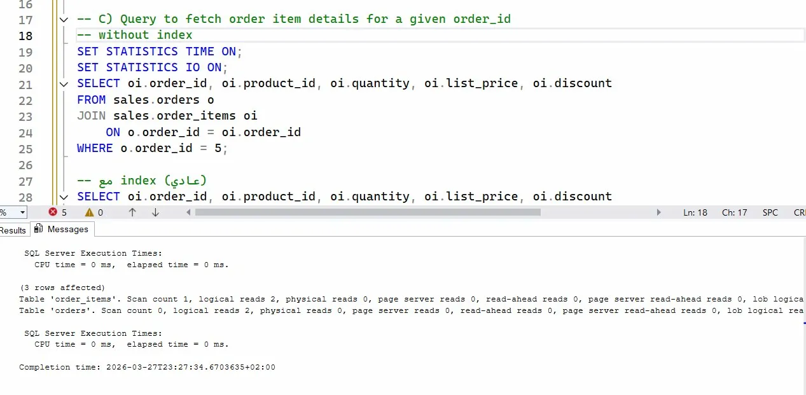
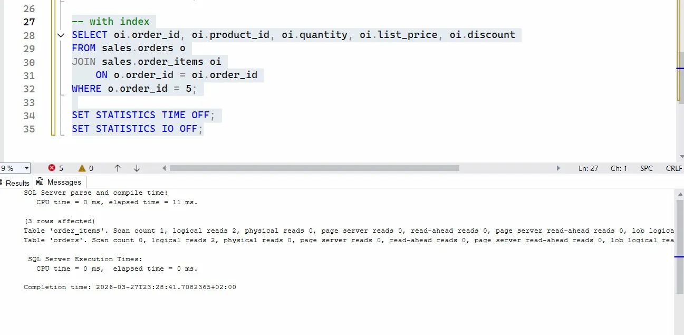
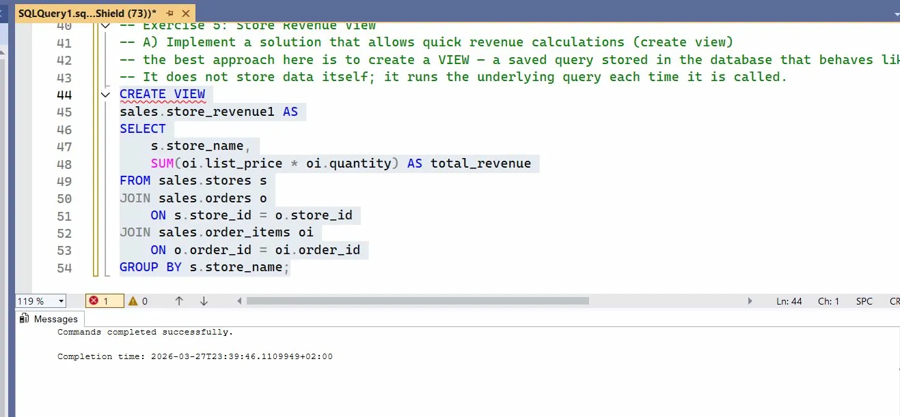
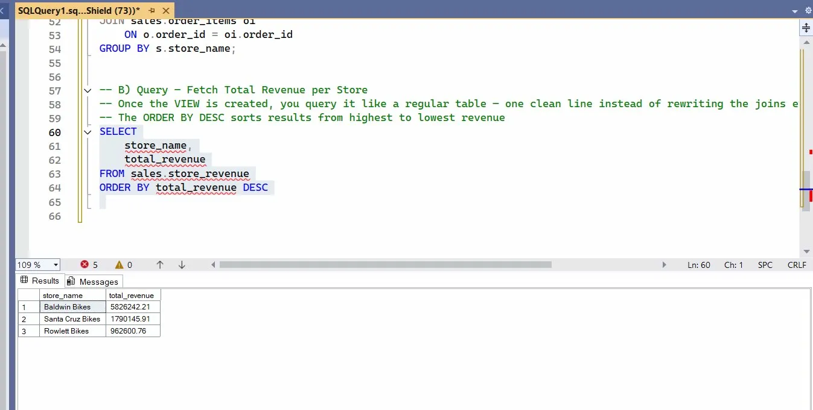

 # Task 2
 
 ## Exercise 4: Order Items Join Optimization

 ### -- A) Optimization method
- without index we will make full table scan — scanning every row to find matching order items.
--An index on order_id lets the database engine jump directly to the relevant rows using a tree structure,
--reducing lookup time from O(n) to O(log n).
 ### B) Applying the optimization — creating the index
- This tells the database to maintain a index structure on order_id, 
-- which both join lookups and WHERE order_id = ? filters can exploit instantly.

### without index 

### with index 

 ## Exercise 5: Store Revenue View
 ### A) Implement a solution that allows quick revenue calculations (create view)
- the best approach here is to create a VIEW — a saved query stored in the database that behaves like a virtual table.
- It does not store data itself; it runs the underlying query each time it is called.

### B) Query — Fetch Total Revenue per Store
- Once the VIEW is created, you query it like a regular table — one clean line instead of rewriting the joins every time
- The ORDER BY DESC sorts results from highest to lowest revenue

